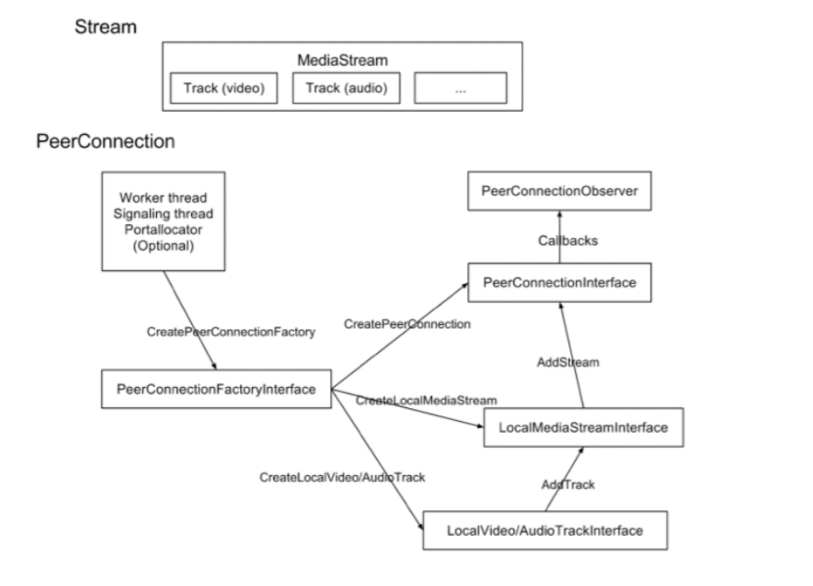
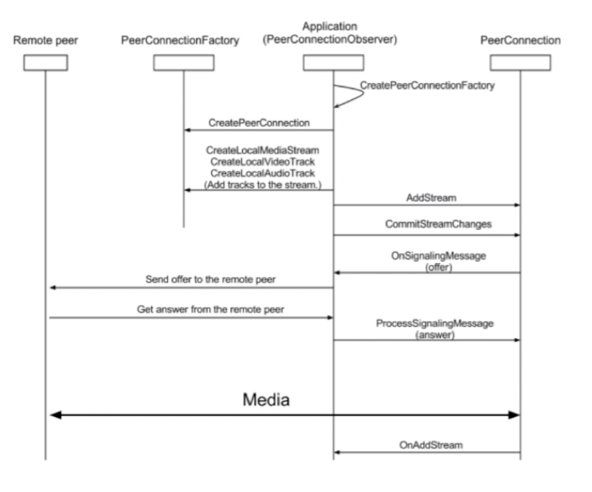
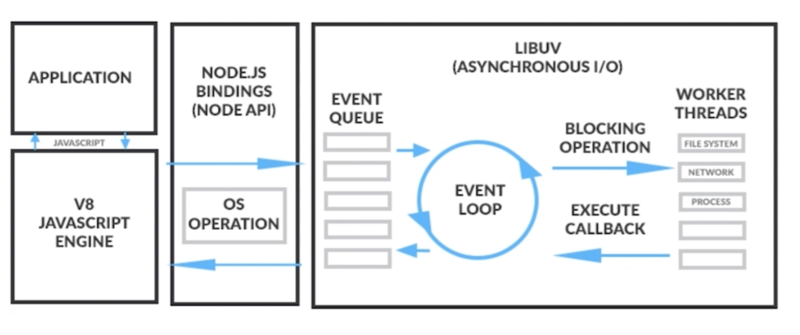
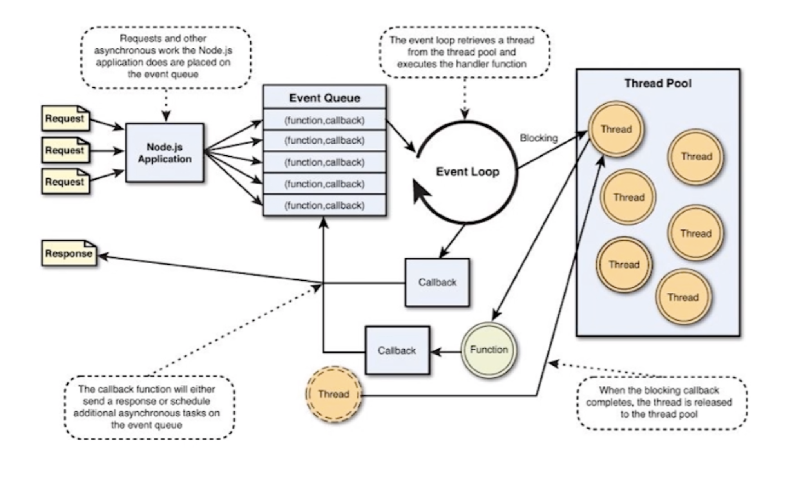
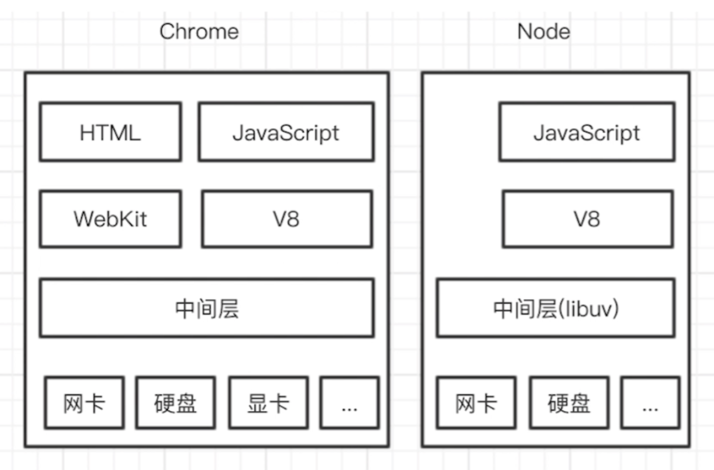

#    web rtc学习笔记

## 是什么

+ WebRTC即网页即时通信（web real-time communication）
+ 是一个支持网页浏览器进行实时语音通话或者视频对话的API
+ 允许浏览器之间直接连接

## 能做什么

1. 音视频实时互动
2. 游戏、即时通讯、文件传输等
3. 一个百宝箱，传输、音视频处理(降噪、回音消除、自动增益等）

## 为什么使用webRTC?

我们认为您会希望使用 WebRTC 构建您的下一个视频聊天风格的应用程序。原因如下：

- Web 成功的一个关键因素是它的核心技术——例如 HTML、HTTP 和 TCP/IP——是开放的并且可以自由实施。目前，还没有可以在浏览器中进行通信的免费、高质量、完整的解决方案。WebRTC 实现了这一点。
- 已与过去 8 年多来已在数百万个端点上部署的同类最佳语音和视频引擎集成。Google 不收取 WebRTC 的版税。
- 包括和抽象关键的 NAT 和防火墙穿越技术，使用 STUN、ICE、TURN、RTP-over-TCP 和对代理的支持。
- 建立在 Web 浏览器的优势之上：WebRTC 通过提供一个直接映射到`PeerConnection`. 因此，Web 开发人员可以为他们的使用场景选择协议（例如但不限于 SIP、XMPP/Jingle 等）。

## Demo

[demo](https://appr.tc)

## websocket

+ websocket是一种在单个**TCP**连接上进行全双工通信的协议
+ 允许服务器主动向客户端推送数据
+ 在websocket api中浏览器和服务器只需要完成一次握手，两者之间就直接创建持久性的连接，并进行双向数据传输

## 为什么使用webrtc而不使用websocket


## web rtc 整体架构


[官网传送门](https://webrtc.github.io/webrtc-org/architecture/)

整个浅绿色部分都属于webrtc核心架构层，它封装各种提供给web端使用的web API层接口。

紫色部分是Web开发者API层。属于应用层，使用核心层提供的API。

### webRTC核心层分为四层：

1. `WebRTC C C++ API(PeerConnection)`：这层的API相对较少，最重要就是实现P2P连接。在PeerConnection里面又包含了很多接口，如传输质量，传输质量报告，统计数据，各种流都是封装再PeerConnection模块里面。除此之外主要是有音视频采集，音视频传输，非音视频数据传输等。
2. `Session Managemeng/Abstract signaling(Session)`：会话层，用来管理音视频，非音视频数据传输，处理相关逻辑
3. 最核心的第三层包含：音频引擎，视频引擎，传输。
4. 最底层是与硬件相关的硬件适配层：这层包含：音频的采集和渲染，视频的捕捉，网络IO。注意到上图中底层的这三个模块画的都是虚线，表示这些模块是可以自己去实现的，可以重载的，这样大大增加了WebRTC的灵活性，为跨平台提供了基础。

### WebRTC最核心的三大模块:

`Voice Engine`，`Video Engine`，`Transport`。这三层中`Voice Engine`只处理音频相关的技术，`Vodeo Engine`处理视频相关的技术，视频和音频是相互独立的，一个重要的技术：音视频同步并不包含再里面。

#### Voice Engine音频引擎包含3大模块：

`iSAC/iLBC Codec`这个模块主要是编解码，iSAC/iLBC是jips公司开发的，另外有我们熟悉的音频G711,G727,AAC,Opus。目前使用最多的也是Opus

`NEtEQ for voice`: NetEQ实际上是一个音频缓冲的buffer，用于网络的适配。如我们做防止音频抖动，这里面设计了很多相关的算法。

`Echo Canceler/Noise Reduction`:这里面解决了很多做音频头疼的问题，回音消除，降噪等问题处理算法。回声消除是困扰很多公司的一个头疼的技术，但WebRTC里面提供了非常成熟，稳定的回声消除算法。其实很多算法工程师做的也是可用像WebRTC一样的开源代码，自己调一些参数，来提高音频质量。

#### Video Engine 视频引擎包含3大模块：

`VP8 Codec`:这块主要是视频编解码器，VP8，VP9都是Google开发出来的，之前WebRTC最先支持的是自己家的VP8，后面也支持H264,H265,Open H264, xh264(在官方的WEBRTC里面是不支持的，如果想支持可以自己安装Open H254的模块进去)

`Video jitter buffer`:视频jitter buffer根音频buffer一样也是用来防止视频防抖的

`Image enhancements`：这块是图像处理相关的，如图像增加处理，对WERERC来说图像增强这一块做比较薄。它把相应的接口也都留出来了，如果你想做一些美颜，贴图，滤镜处理，你也可以再提供的预留接口中去实现。像人脸视频这些接口都有，都可以加入进去。

#### Transport传输模块包含3大模块：

传输底层用的是UDP协议，因为音视频传输对及时性要求更高，允许部分丢帧，WEBRTC充分利用的UDP的不管控能力，利用各种成熟的算法保证高质量的音视频传输，可以自动适配码率转换。所有音视频的数据的发送、接收到时通过传输层去做的，从图中可以看出来，WEBRTC的架构层次非常清晰。

+ SRTP：一般正常视频传输都是使用的RTP协议，但是由于浏览器对安全性要求比较高，增加了加密这块的处理，采用SRTP协议。还有控制流的传输协议RTCR，将相应的数据发送，接收报告发送给对方，这样对方就可以做流控处理。
+ Multplexing：这里主要是多个流复用统一通道
+ P2P（STUN+TURN+ICE）：这里注意是P2P相关的技术，这是WEBRTC最核心的技术，像以前做安防这块的P2P技术都是属于各个公司最核心的技术，现在WEBRTC的原理这里面这块技术非常成熟。

整个传输层包括了对线路的检测，网络丢包，抖动，流控，NAT穿透打洞等等非常复杂的技术都实现了非常成熟的方案。

WEBRTC传输层这块还实现了通过计算去估算你的网络带宽，不仅仅可以实现稳定的音视频传输，还可以传输其他非音视频数据，如文件、文本等二进制数据都可以传输。

需要注意的是，在WEBRTC的核心层是没有视频渲染的，视频的渲染需要应用层去做。

## webrtc的运行机制

1. 轨与流
   1. track: 音轨，视频轨等等，平行不相交
   2. mediastream：媒体流，包含多个track
2. 重要的类
   1. mediastream
   2. RTCPeerConnection
   3. RTCDataChannel

​	peerConnection调用 过程



调用时序图



## Web服务器

### 选型

1. NodeJs
2. Nginx
3. Apache

### NodeJs工作原理



### NodeJs事件处理



###  两个V8引擎



### 创建HTTPS服务

1. 为什么使用https服务？

   + 个人隐私及安全原因

2. 什么是https?

   + 简单来说 HTTPS = http + TLS/SSL

3. HTTPS基本原理

   

   4. Nodejs搭建HTTPS服务
      + 生成HTTPS证书
      + 引入HTTPS模块
      + 指定证书位置，并创建HTTPS服务

## 获取设备

`enumerateDevices`请求一个可用的媒体输入和输出设备的列表

1. `const promise = navigator.mediaDevices.enumerateDevices()`
2. `MediaDevicesInfo`
   1. `deviecID`:设备ID
   2. `label`:设备名字
   3. `kind`:设备种类
   4. `groupID`:两个设备`groupID`相同，说明是同一个物理设备

## 音视频采集

1. [`MediaDevices.getUserMedia(constraints)`](https://developer.mozilla.org/zh-CN/docs/Web/API/MediaDevices/getUserMedia):会提示用户给予使用媒体输入的许可，媒体输入会产生一个`MediaStream`，里面包含了请求的媒体类型的轨道。

   + `constraints`

     ```json
     dictionary MediaStreamConstraints {
        (Boolean or MediaTrackConstraints) video = true
        (Boolean or MediaTrackConstraints) audio = true
     }
     // 比如
     { audio: true, video: true }
     // 视频相关  min max 
     {
       audio: true,
       video: { width: 1280, height: 720 }
     }
     // 帧率 frameRate min max
     // facingMode  user:前置摄像头 environment：后置摄像头  left前置左侧摄像头   right前置右侧摄像头
     // resizeMode  裁剪
     
     // 音频相关
     // echoCancellation 回音消除
     // autoGainControl 自动增益
     // noiseSuppression 降噪 
     // latency 延迟大小 
     // channelCount 单声道双声道
     
     // 公共都有
     // deviceId
     // groupId
     ```

2. [`mediaStream`](https://developer.mozilla.org/en-US/docs/Web/API/MediaStream)

   + addTrack
   + removeTrack
   + getVideoTrack
   + getAudioTrack 

3. [`mediaRecorder`](https://developer.mozilla.org/en-US/docs/Web/API/MediaRecorder)

   + const mediaRecorder = new MediaRecorder(stream [,options])
   + Stream: 媒体流，可从getUserMedia， video, audio, canvas获取
   + options:选型
     + mimeType:video/webm、video/webm、video/webm;codecs=vp8、video/webm;codecs=h264、audio/webm;codecs=opus
     + AudioBitsperSecond：音频码率 
     + videoBitsPerSecond：视频码率
     + bitsPerSecond:整体码率
   + MediaRecorder.start(timeslice)
     + 开始录制媒体，timeslice可选，如果设置了会按照时间切片存储
   + MediaRecorder.stop()
     + 停止录制，此时会触发包括最终Blob数据的datavailable事件
   + MediaRecorder.pause()
   + MediaRecorder.resume()
   + MediaRecorder.isTypeSupported()
   + MediaRecorder.ondataavailable
     + 每次记录一定时间的数据时（如果没有指定时间片，则记录整个数据时）会定期触发
   + MediaRecorder.onerror
     + 每当有错误发送时，录制会被停止
   + 几种存储数据的方式
     + 字符串
     + blob
     + arraybuffer
     + arraybufferview

4. [`getDisplayMedia`](https://developer.mozilla.org/en-US/docs/Web/API/MediaDevices/getDisplayMedia)提示用户选择并授予权限以将显示或其部分（例如窗口）的内容捕获为 MediaStream。

   + `constraints`同`getUserMedia`

## socket.IO消息

### 为什么选择socketIO

+ 是websocket的超集
+ 有房间的概念
+ 跨平台，跨终端，跨语言

### 服务端发送消息

1. 给本次连接发消息
   + socket.emit()
2. 给某个房间内所有人发消息
   + io.in(room).emit()
3. 除本连接外，给某个房间内所有人发送消息
   + Socket.to(room).emit()
4. 除本连接外，给所有人发消息
   + socket.boradcast.emit()

### 客户端处理消息

+ S：socket.emit('action', arg1, arg2);
+ C：socket.on('action', function(arg1, arg2) {});

## webrec传输

+ NAT(Network Address Translator)
  + 
  
  + 产生的原因
    + 由于IPv4的地址不够
    + 出于网络安全的原因
  
  + 种类
    + 完全锥型NAT(Full Cone NAT)
      + 
    + 地址限制锥型NAT(Address Restricted Cone NAT)
      + 
    + 端口限制锥型NAT(Poer]]rt Restricted Cone NAT)
      + 
    + 对称型NAT(Symmetric NAT)
      + 
  
  + NAT穿越原理
  
    + C1, C2向STUN发消息
    + 交换公网IP及端口
    + C1 -> C2,  C2 -> c1, 甚至是端口猜测
  
  + NAT穿越组合
  
    + | 全锥型       | 全锥型       | √    |
      | ------------ | ------------ | ---- |
      | 全锥型       | 受限锥型     | √    |
      | 全锥型       | 端口受限锥型 | √    |
      | 全锥型       | 对称型       | √    |
      | 受限锥型     | 受限锥型     | √    |
      | 受限锥型     | 端口受限锥型 | √    |
      | 受限锥型     | 对称型       | √    |
      | 端口受限锥型 | 端口受限锥型 | √    |
      | 端口受限锥型 | 对称型       | ×    |
      | 对称型       | 对称型       | ×    |
+ STUN(Simple Traversal of UDP Through NAT)
+ TURN(Traversal Using Relays around NAT)
+ ICE(Interactive Connectivity Establishment)
+ 


